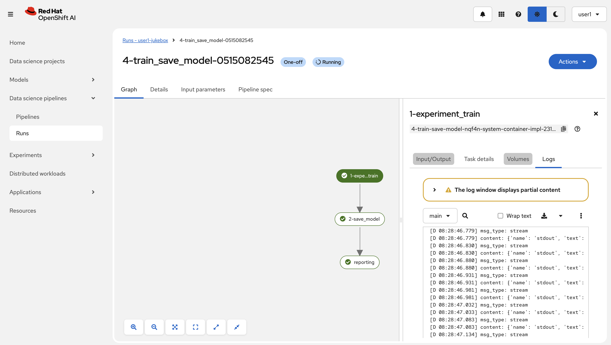

## Elyra

Elyra is an open-source project that enables data scientists to create complex pipelines visually 💛 Elyra supports rapid prototyping and experimentation, allowing users to leverage existing Jupyter notebooks and run them as a pipeline which simplifies the pipeline development process A LOT.

Now we’ll take the notebooks from the previous exercises and use Elyra to turn them into a streamlined pipeline!

1. Go back to your Workbench, and open up the file `jukebox/2-dev_datascience/4-train_save_model.pipeline`. Notice that the file is has `*.pipeline` extension, this is how Elyra saves the pipeline definition. 

    You'll see two notebooks connected with a line. First one builds the model and the second one saves it to `models` bucket. The line indicated that the second one only runs if the first one is succesful. These notebooks are the ones we went through in the previous exercise.

    

    Let's add a third one as an example.

2. While you are in the folder `2-dev_datascience`, on the left menu (File Browser), right click on an empty space and select `New Notebook`, keep the kernel selection as it is and click `Select`. It creates `Untitled.ipynb`. 

3. Copy the code block below and paste it into the newly created Notebook. (or feel free to get creative :D)

    ```python
    print("Pipeline has finished successfully! Yayy!! ✨")
    ```

    Hit Save! (or CTRL+S) and if you like, rename the Notebook to something like `4-reporting.ipynb`

    


4. Then drag that Notebook and drop it into `4-train_save_model.pipeline` file. Connect the `2-save_model.ipynb` and your new `4-reporting.ipynb`. This will make the reporting run after saving the model. Lastly, make sure you hit **save** to store the changes.

    


5. Let's run the pipeline! Hit `Run Pipeline` and click `OK` It might take some time to initiate the pipeline.

    

6. When it is triggered successfully, you'll get the below output. Click `Run Details` to follow the steps and see the pipeline outputs. It will take you to OpenShift AI's Pipeline view.

    

7. You'll see everything green when the pipeline runs successfully :)

    

    As you experienced, Elyra is pretty straightforward and easy to set up! It is great to start with, however when we need more complex pipelines, it's better to transition to a tool like KFP that has more advanced features. 
