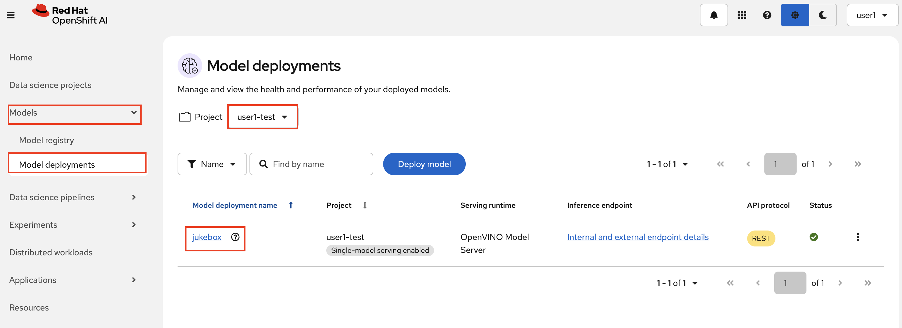

## User Workload Monitoring

> OpenShift’s has monitoring capabilities built in. It deploys the Prometheus stack and integrates into the OpenShift Console for consuming cluster metrics. 

1. Let's view some out of the box dashboards. Go to OpenShift AI Dashboard > `<USER_NAME>-test` > Model Serving view and click on `jukebox` model.

    

    You can see the graphs about incoming requests, CPU and memory consumption to give you an idea about the model utilization. 

    


2. There are other metrics that the runtime exposes and OpenShift collects out of the box. You can run queries for the existing metrics easily with `promql`, a query language for Prometheus, and then decide if there are more metrics you would like to visualize. On the `OpenShift Console` > `Developer view` go to `Observe`, it should show basic health indicators just like `OpenShift AI Dashboard`. 

    

    There are multiple dashboards already ready for you to observe your deployed model `jukebox`. Generate some traffic by using the Jukebox UI and check here!


3. You can also query Prometheus by using promql query language to get some info about successfull requests to `jukebox` in your test environment. 

    Go to  `Metrics` tab and paste the below query and hit `Enter`.

    ```bash
    ovms_requests_success{namespace="<USER_NAME>-test", interface="REST"}
    ```

    

    _Note: Ignore the "Access restricted" warning, as is just cosmetic error and doesn't affect the metric query._

### Deploy Grafana

> Let's create some more dashboards with specific information about our model!

1. We can deploy a Grafana instance in our `mlops` environment. Yet another tooling to support the end to end journey of Jukebox. Therefore we need to install it through `mlops-gitops/toolings/`

    Create `grafana` folder under `toolings`. And then create a file called `config.yaml` under `grafana` folder. Or simply run the below commands:

    ```bash
    mkdir /opt/app-root/src/mlops-gitops/toolings/grafana
    touch /opt/app-root/src/mlops-gitops/toolings/grafana/config.yaml
    ```

2. Open up the `grafana/config.yaml` file and paste the below line to let Argo CD know which chart we want to deploy.

    ```yaml
    chart_path: charts/grafana
    ```

3. Commit the changes to the repo as you’ve done before.

    ```bash
    cd /opt/app-root/src/mlops-gitops
    git pull
    git add .
    git commit -m "📈 Grafana added 📈"
    git push
    ```

4. Once this change has been sync’d (you can check this in Argo CD), let’s login to Grafana by clicking [here](https://jukebox-grafana-route-<USER_NAME>-mlops.<CLUSTER_DOMAIN>) and view the predefined dashboards for Jukebox. Alternatively, you can use the run the below command in your code-server workbench terminal:

    ```bash
    # get the route and open it in your browser
    echo https://$(oc get route jukebox-grafana-route --template='{{ .spec.host }}' -n <USER_NAME>-toolings)

    ```

    Use your OpenShift credentials and click `Allow selected permissions` to log in.

5. In order to view the dashboards, go to `Dashboards` > `grafana <USER_NAME>-mlops Dashboards` > `OpenVINO Model Server - Model Metrics`.

    _Note: it might take some time to sync the dashboard configuration. Just do a hard refresh of the page if you cannot see it in the first try._

    
    
    You'll see a dashboard like this:

    

    Since the dashboards are defined as code, any changes you make here will be temporary and will not persist—true GitOps in action!👻


Now let's move to another exciting tool; TrustyAI 🔦🏡