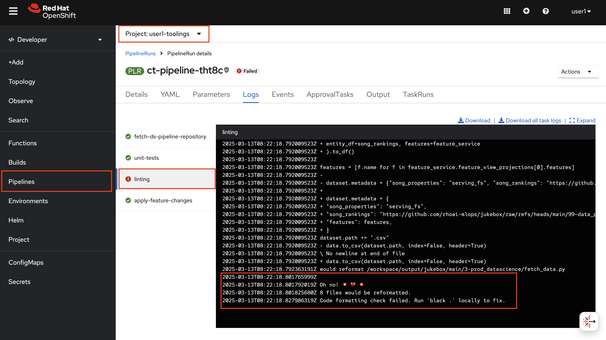
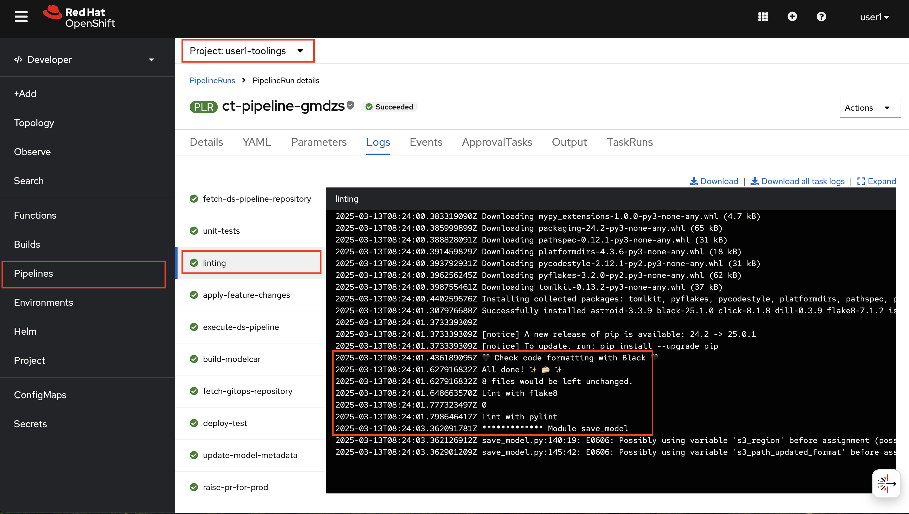

## Linters

> Linting is important to reduce errors and improve the overall quality of your code. Using lint tools can help you accelerate development and reduce costs by finding errors earlier.

### Code Linting

For code linting, there are several Python libraries available to ensure code quality: `black` for formatting, `isort` for sorting imports, and `flake8` for detecting syntax errors or undefined names, among others. These tools can be integrated into our Continuous Training pipeline to automatically enforce code quality checks and maintain consistency. Neglecting good coding practices or failing to write clean code can lead to significant maintenance challenges over time, making it crucial to prioritize quality from the start.

Let's use one of them manually before adding to the pipeline:

1. Go to your code server workbench and on the terminal run the below code.

    ```bash
    cd /opt/app-root/src/jukebox/3-prod_datascience
    pip install black
    black . --check --diff
    ```

2. You may get a result similar to this:
   
   

3. Let's also see `flake8` output:

    ```bash
    cd /opt/app-root/src/jukebox/3-prod_datascience
    pip install flake8
    flake8 . --show-source
    ```

4. You may get an output like below:

    

So there are room for improvement :) By just adding such checks on our pipelines, we can maintain high code quality standards. 

Before we adding linters, let's introduce another tool.

### Kube Linting

KubeLinter is an open source tool that analyzes Kubernetes YAML files and Helm charts, checking them against a variety of best practices, with a focus on production readiness and security. We can use `kubelinter` to check our model deployment helm chart.

1. KubeLinter has a load of built in best practices to check for when performing a lint. We can list them.

    ```bash
    kube-linter checks list | grep Name:
    ```

    <div class="highlight" style="background: #f7f7f7">
    <pre><code class="language-yaml">
    Name: cluster-admin-role-binding
    Name: dangling-service
    Name: default-service-account
    Name: deprecated-service-account-field
    Name: docker-sock
    Name: drop-net-raw-capability
    Name: env-var-secret
    Name: exposed-services
    Name: host-ipc
    Name: host-network
    Name: host-pid
    Name: mismatching-selector
    Name: no-anti-affinity
    Name: no-extensions-v1beta
    Name: no-liveness-probe
    Name: no-read-only-root-fs
    Name: no-readiness-probe
    Name: non-existent-service-account
    Name: privilege-escalation-container
    Name: privileged-container
    Name: privileged-ports
    Name: required-annotation-email
    Name: required-label-owner
    Name: run-as-non-root
    Name: sensitive-host-mounts
    Name: ssh-port
    Name: unsafe-proc-mount
    Name: unsafe-sysctls
    Name: unset-cpu-requirements
    Name: unset-memory-requirements
    Name: writable-host-mount
    </code></pre></div>

    However those are valid by default only for generic Kubernetes resources such as `Deployment` or `Service`. Our model deployment utilizes custom resources such us `InferenceService`. Therefore, kube-linter by default cannot check them, but we can see its built in capabilities by running `kube-linter` on Jukebox UI helm chart.

2. Let's try **kube-linter** out on Jukebox UI chart folder. 
   
    ```bash
    cd /opt/app-root/src/
    git clone https://<USER_NAME>:<PASSWORD>@gitea-gitea.<CLUSTER_DOMAIN>/<USER_NAME>/jukebox-ui.git
    cd /opt/app-root/src/jukebox-ui
    kube-linter lint chart
    ```

    It reports this:
    <div class="highlight" style="background: #f7f7f7; overflow-x: auto; padding: 10px;">
    <pre><code class="language-bash">
    /opt/app-root/src/jukebox-ui/chart/templates/deployment.yaml: (object: <no namespace>/jukebox-ui apps/v1, Kind=Deployment) container "jukebox-ui" does not have a read-only root file system (check: no-read-only-root-fs, remediation: Set readOnlyRootFilesystem to true in the container securityContext.)

    Error: found 1 lint errors
    </code></pre>
    </div>

    _..which is luckily not a problem for OpenShift users because OpenShift by default mounts the container's root filesystem as read-only, so we don't have to specify this in our deployments 🎉_

    If you would like to extend kube-linter checks of the common Kubernetes objects or extend the checks to Custom Resources such as `InferenceService`, please look at [product documentation](https://docs.kubelinter.io/#/configuring-kubelinter?id=run-custom-checks).

### Helm Linting

We can also use `helm lint` to examine a chart for possible issues. If helm linter encounters things that will cause the chart to fail installation, it will throw error messages. If it encounters issues that break with convention or recommendation, it will let you know with a Warning.

1. Let's try **helm linter** out on model deployment chart folder before adding it as a step to our pipeline. 

    ```bash
    cd /opt/app-root/src/
    cd /opt/app-root/src/mlops-helmcharts/charts/model-deployment/
    helm lint music-transformer-with-feast
    ```

    Great! No charts failed 👏

    <div class="highlight" style="background: #f7f7f7; overflow-x: auto; padding: 10px;">
    <pre><code class="language-bash">
    $ helm lint music-transformer-with-feast 
    ==> Linting music-transformer-with-feast
    [INFO] Chart.yaml: icon is recommended

    1 chart(s) linted, 0 chart(s) failed
    </code></pre>
    </div>

## Extend Pipeline


We’re adding a new Task to our Tekton pipeline to perform linting before triggering the data science pipeline. This ensures that we catch any issues with code or deployment files early on, saving time and resources by avoiding unnecessary training runs when the code doesn’t meet required standards.

1. Open up `mlops-gitops/toolings/ct-pipeline/config.yaml` and add `linting: true` flag to introduce [linting task](https://<GIT_SERVER>/<USER_NAME>/mlops-helmcharts/src/branch/main/charts/pipelines/templates/tasks/linting.yaml).

    ```yaml
    chart_path: charts/pipelines
    USER_NAME: <USER_NAME>
    cluster_domain: <CLUSTER_DOMAIN>
    git_server: <GIT_SERVER> 
    alert_trigger: true 
    apply_feature_changes: true
    unit_tests: true
    linting: true # 👈 add this
    ```

2. Commit the changes to the repo:

    ```bash
    cd /opt/app-root/src/mlops-gitops
    git pull
    git add .
    git commit -m "☀️ linting task is added ☀️"
    git push
    ```

    Go to OpenShift Console > Pipelines in `<USER_NAME>-toolings` namespace to verify that the `linting` task is included in the  Pipeline now:

    

3. Kick off a pipeline with an empty commit to see the changes on the pipeline:

    ```bash
    cd /opt/app-root/src/jukebox
    git commit --allow-empty -m "🩴 trigger pipeline for linting 🩴"
    git push
    ```

4. Watch `Pipeline Run` to fail with he same mistake you saw previously. 

    

5. Let's fix the errors and make the pipeline pass linting step. Go back to the terminal on your code-server workbenc and run the following commands:
   
    ```bash
    cd /opt/app-root/src/jukebox/3-prod_datascience
    black .
    ```

6. After `black` fixes the formatting, let's push the changes and kick off a new pipeline:

    ```bash
    cd /opt/app-root/src/jukebox
    git add .
    git commit -m "🪄 black format fixes 🪄"
    git push
    ```

7. Observe the pipeline passes the `linting` step this time 🥳

    


