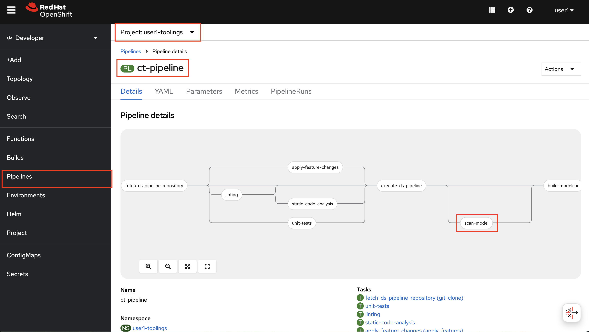
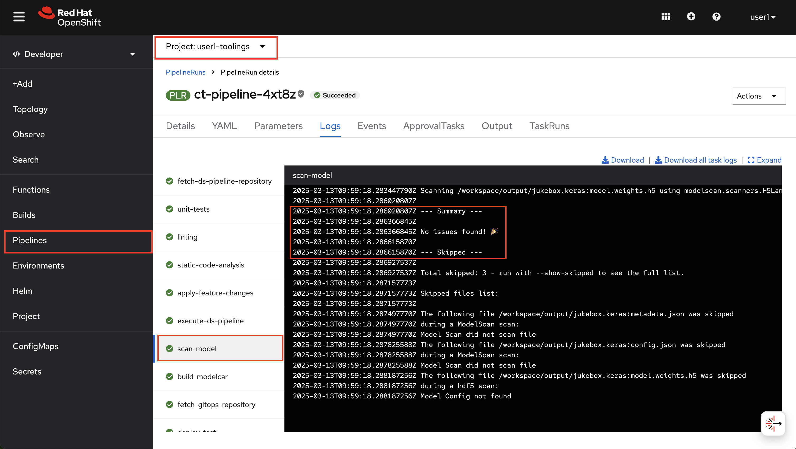

# Model Security

AI models are powerful tools, but they also come with security risks. Just like any other software, they can be targeted by attackers looking to steal data, manipulate results, or gain unauthorized access. One common method of attack is through **Model Serialization Attacks**.

So, what’s that? Basically, when a model gets saved and loaded, it goes through a process called serialization. If this isn’t handled properly, someone can slip in malicious code. These attacks can result in:

- Credential Theft – Attackers can extract cloud credentials stored in the model to access other systems.
- Data Theft – Incoming requests to the model often contain valuable information. If an attacker can intercept them, they may be able to steal private or sensitive data.
- Data Poisoning – Attackers can manipulate the input data before it reaches the model, causing it to produce misleading or harmful results. This can be especially dangerous in automated decision-making systems.
- Model Poisoning – Instead of just corrupting the data, an attacker might alter the model itself, changing how it behaves over time. This could lead to biased, inaccurate, or even malicious outputs.

To defend against these, we can scan the model for insecurities before we use it.

## Explore Model Scanning

1. We'll use an open source too called `modelscan` to scan the model to determine if they contain unsafe code. Let's go to Jupyter Notebook workbench to first get familiar with the tool. Open up the notebook `8-securing_ai/1-modelscan.ipynb` and go through the cells. 

## Include Model Scanning in the pipeline

1. Now, let's create a task in our pipeline after the model is created but before generating the `modelcar` artifact. If the model has vulnerability to attack, no need to store it in our OCI registry since we are not going to deploy it.

    In order to do that, we need to update out update. Go over to code-server workbench and add below line to `mlops-gitops/toolings/ct-pipeline/config.yaml`. It will enable a Tekton task to run basically the same commands you just ran in the Notebook:

    ```yaml
    chart_path: charts/pipelines
    USER_NAME: <USER_NAME>
    cluster_domain: <CLUSTER_DOMAIN>
    git_server: <GIT_SERVER> 
    alert_trigger: true 
    apply_feature_changes: true
    unit_tests: true
    linting: true 
    static_code_analysis: true
    model_scanning: true # 👈 add this
    ```


2. Commit and push the changes to git:

    ```bash
    cd /opt/app-root/src/mlops-gitops
    git pull
    git add .
    git commit -m "🦠 Model scanning added 🦠"
    git push
    ```

    Your pipeline should now look like this:  
    

3. Create an empty commit to trigger the pipeline and perform scan:
    ```bash
    cd /opt/app-root/src/jukebox
    git commit --allow-empty -m "☢️ trigger pipeline for model scanning ☢️"
    git push
    ```


4. You should see an output like this 🎉

    